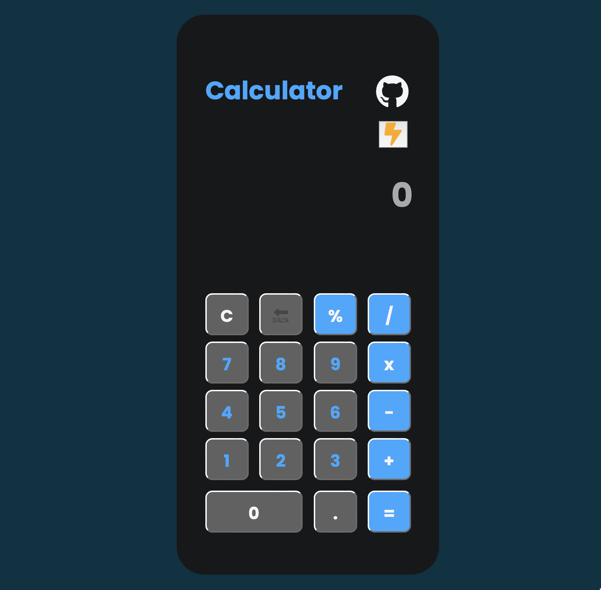
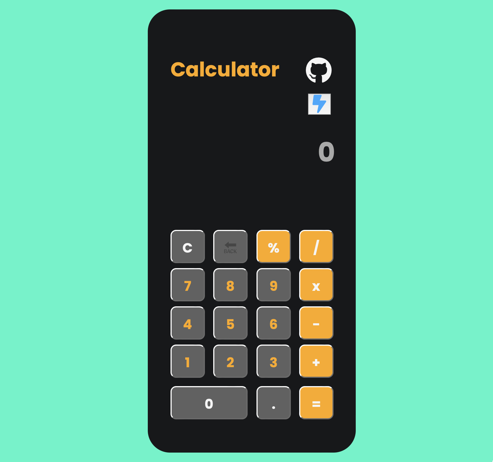

  

  <h2 align="center">Javascript~Calculator</h2>

  

    An Awesome Calculator build using HTML, CSS & JavaScript with light and dark mode feature.
    Feel free to check out the code.
     
    <a href="https://github.com/amitesh855/Codesoft"><strong>Explore the Code »</strong></a>
     
     
    
  

## Snapshot⚡️
### Dark-Mode

 

### Light-Mode

